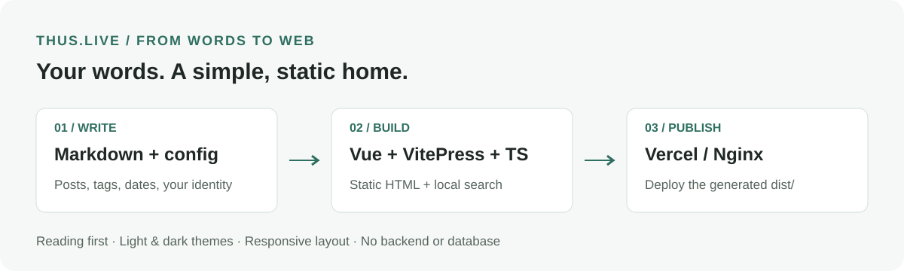
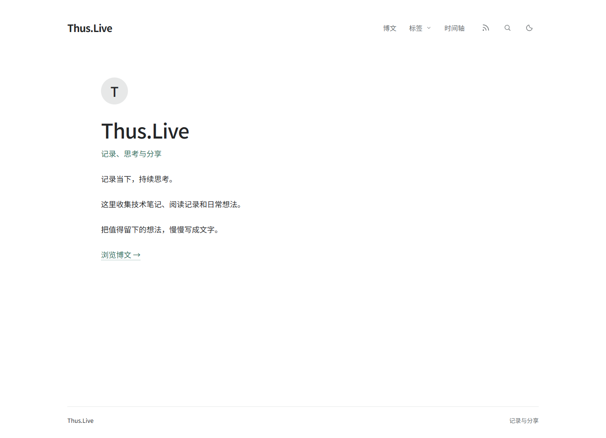
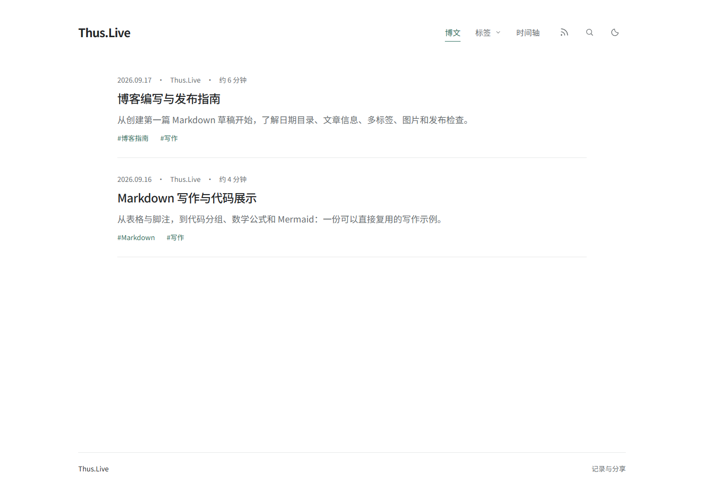
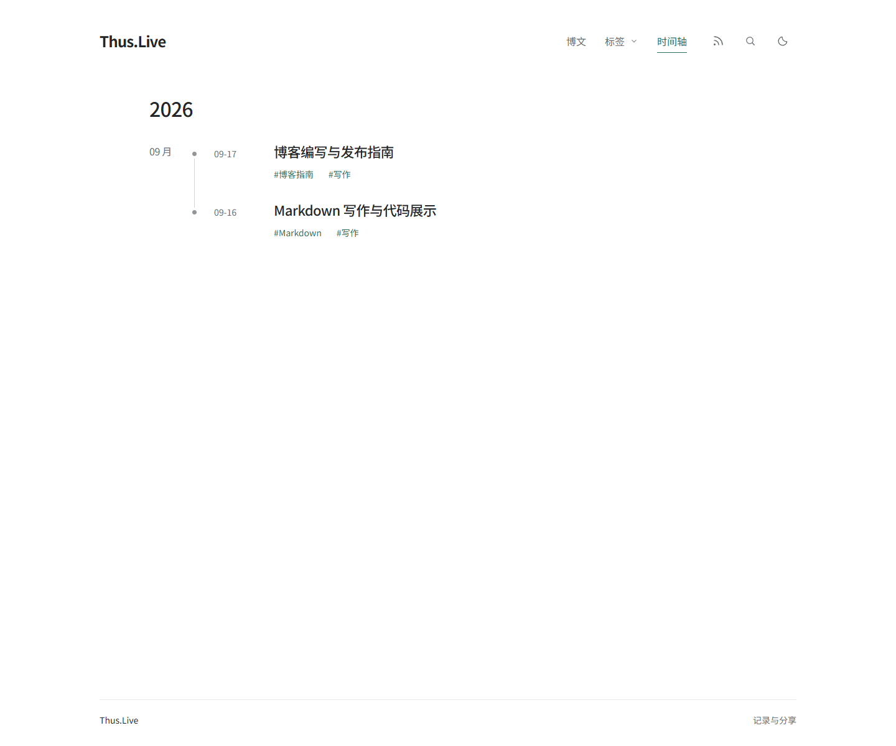
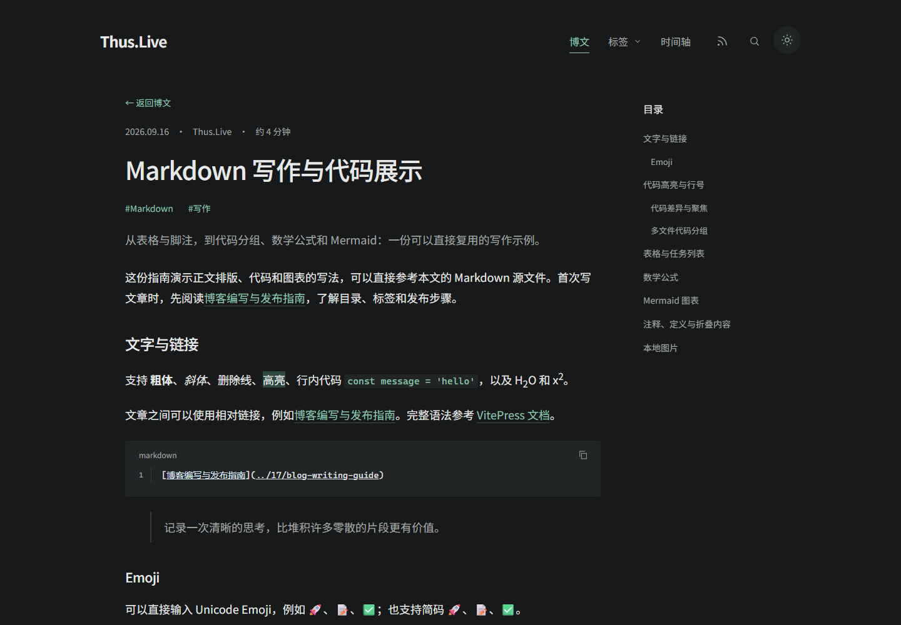
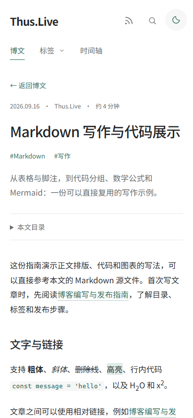
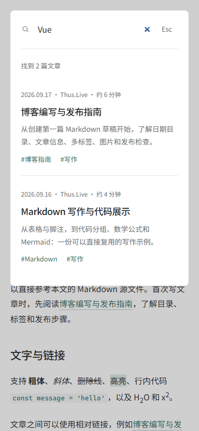

# Thus.Live

一个以阅读和写作为中心的 **Vue 3 + VitePress + TypeScript 静态博客模板**。用 Markdown 写文章，按日期目录归档，生成可部署到 Vercel 或 Nginx 的纯静态网站，无需后端或数据库。

[English](README.en.md) · [个人配置](docs/CONFIGURATION.md) · [RSS 订阅](docs/RSS.md) · [部署](docs/DEPLOYMENT.md) · [私有博客](docs/PRIVATE-BLOG.md) · [0BSD 协议](LICENSE)

**AI 协作说明：本项目由人类提出需求、选择设计并验收，AI（ChatGPT / Codex）协助完成界面设计、代码实现、测试与文档。** 这是开发方式说明，不构成额外的署名或使用条件。

Thus.Live 是品牌写法，不是一句完整英文；代码包名为 `thus-live`。名称中的 `.Live` 不代表已注册域名，项目不预设真实域名或个人身份。

## 项目一览



用 Markdown 专注写作，由构建流程整理文章、标签与归档，最终发布为无需后端的静态博客。

## 截图展示

以下截图来自仓库默认内容的实际运行页面，界面文案为中文。点击图片可查看原图。

### 首页



### 博文与时间轴

| 博文列表 | 时间轴归档 |
| --- | --- |
|  |  |

### 深色阅读



### 手机端阅读与搜索

| 响应式文章 | 本地全文搜索 |
| --- | --- |
|  |  |

## 功能

- Markdown 自定义首页、按日期倒序的博文列表与「加载更多」。
- 每篇文章支持多个标签，提供标签菜单、标签索引和单标签筛选；时间轴支持按年、月、日浏览。
- 本地全文搜索覆盖标题、摘要、正文和标签，搜索索引在首次打开时加载，无需外部搜索服务。
- 列表与正文统一显示 **日期 · 作者 · 阅读时间**；搜索结果也显示作者。
- 时间轴圆点与日期对齐；桌面、平板与手机布局。
- 亮色 / 暗色主题、轻量动效、键盘导航、减少动态效果支持。
- Shiki 代码高亮、行号、复制、diff、代码分组与聚焦。
- 表格、任务列表、脚注、定义列表、公式、Mermaid、Emoji 和 Vue 组件。
- 构建时生成独立 HTML；基础文章在禁用 JavaScript 时仍可阅读。
- 构建时生成 `robots.txt`；配置正式域名后生成 RSS、sitemap、canonical 和 Open Graph 元数据。
- RSS 订阅页、地址复制与按标签订阅，导航栏提供入口。
- 文章二、三级标题目录、当前章节高亮、更新日期与相邻文章导航。
- 内置 SVG / ICO 站点图标，以及随主题着色的 SVG 界面图标。

仓库内仅保留 [Markdown 写作与代码展示](content/posts/2026/09/16/markdown-guide.md) 和 [博客编写与发布指南](content/posts/2026/09/17/blog-writing-guide.md)，可作为写作参考，也可以替换为自己的内容。

## 页面与设计

以文字阅读为中心，采用白色 / 中性暗色背景、青绿色链接、宽松留白和细线分隔。首页内容由 Markdown 决定；博文列表突出标题与摘要，时间轴按年月组织文章，正文在桌面端配有右侧粘性目录。

| 页面 | 路径 | 内容 |
| --- | --- | --- |
| 首页 | `/` | Markdown 介绍、可选头像与自定义链接 |
| 博文 | `/blog` | 日期倒序列表，按 `pageSize` 分批加载 |
| 标签 | `/tags`、`/tags/<slug>` | 标签文章数与单个话题的文章列表 |
| 时间轴 | `/archive`、`/archive/YYYY[/MM[/DD]]` | 全部记录或指定日期范围的归档 |
| 文章 | `/posts/YYYY/MM/DD/<slug>` | 元信息、摘要、正文、目录和相邻文章 |
| RSS | `/rss` | 全站与标签订阅地址、复制按钮 |

平板端正文改为单栏，目录收纳在文章前；手机端使用两行导航，标签自然换行，时间轴保留日期节点与连线。代码、表格和公式在自身区域内横向滚动。详见 [响应式约定](design/responsive.md)。

## 快速开始

需要 **Node.js 22.12+**，推荐 Node.js 24，以及 npm。

```bash
npm ci
npm run dev
```

默认开发地址：`http://127.0.0.1:5174`，编辑内容后自动刷新；端口被占用时以终端输出为准。

```bash
npm run build
npm run preview
```

构建产物为 `dist/`，默认静态预览地址为 `http://127.0.0.1:4174`。重新构建后，需要重启静态预览进程以刷新资源清单。日常修改建议使用 `npm run dev`。

## 换成自己的博客

**站点信息编辑 `site.profile.json`，首页内容编辑 `content/index.md`，不必修改 Vue 组件。** 公开模板里的 profile 保持 `{}`，私有博客在这里提交自己的配置。未填写的字段继承 `site.config.ts` 的模板默认值。

```json
{
  "name": "我的博客",
  "author": "作者名",
  "title": "我的博客 · 记录与分享",
  "description": "记录学习和生活。",
  "avatar": "/avatar.webp",
  "avatarText": "记",
  "url": "https://blog.example.com",
  "footer": "保持好奇，持续记录",
  "pageSize": 10
}
```

示例域名仅是占位，请换成自己的网站地址，或留空 `"url": ""`。图片放在 `content/public/avatar.webp`；头像为空或加载失败时显示占位文字，默认取站点名称首字母。完整字段见 [配置说明](docs/CONFIGURATION.md) 和 `site.profile.example.json`。

作者为全站统一配置，列表与正文共用同一个组件；不需要在每篇文章中填写。修改配置后重新构建并部署。

界面文案目前为中文；`language` 设置文档和 RSS 的语言元数据，不会自动翻译界面。配置会校验未知字段和字段类型，`pageSize` 必须为正整数。旧版配置中的 `role`、`introduction` 应移入首页 Markdown，并从 profile 中删除。

浏览器标签页图标使用 `content/public/favicon.svg` 和 `content/public/favicon.ico`；更换品牌时可同时替换这两个文件。另有 `content/public/brand-mark.svg` 品牌图形可供使用；首页头像仍由 `avatar` / `avatarText` 独立控制。

`site.profile.json` **应提交到自己的私有仓库**，方便 Vercel / Docker 构建读取。它不是密钥文件：其中的名称、简介、作者等会显示在公开网页中。

## 自定义首页

编辑 `content/index.md`，保留开头的 `layout: home`，正文可自由使用 Markdown：

```markdown
---
layout: home
---

<Avatar />

# 你好，我是小记

这里记录我的 **技术笔记** 和日常想法。

- 正在学习 Vue
- 喜欢阅读与摄影

[浏览博文 →](/blog)
```

首页标题、介绍、图片和链接均由这份 Markdown 决定，不再使用 profile 的 `role`、`introduction`。`<Avatar />` 是可选的头像组件，读取 profile 的头像配置；可以删除或换成普通 Markdown 图片。首页也支持与文章相同的表格、代码块和 Markdown 扩展。

`site.profile.json` 的 `title`、`description` 提供默认页面元数据；首页可在 frontmatter 中单独填写 `title`、`description` 覆盖。修改 Markdown 后开发页面自动刷新，发布时重新构建即可。更多说明见 [配置文档](docs/CONFIGURATION.md#首页内容)。

## 创建文章

首次写作可先阅读 [博客编写与发布指南](content/posts/2026/09/17/blog-writing-guide.md)，了解目录组织、文章信息、图片与预览发布流程。

```bash
npm run new:post -- my-first-post --title "我的第一篇文章" --date 2026-09-17
```

省略 `--date` 时按上海时区取当天日期，也可以始终明确指定日期。命令默认创建草稿，不覆盖已有文章。

```text
content/posts/
└── 2026/09/17/
    ├── my-first-post.md
    └── assets/example.svg
```

也支持 `content/posts/2026/09/17/my-first-post/index.md`，方便把每篇文章与图片放在同一文件夹。

```markdown
---
title: 我的第一篇文章
description: 一句话摘要。
tags: [Vue, TypeScript]
draft: false
---

## 开始记录

正文支持 **Markdown**、`行内代码` 和 🚀 Emoji。


```

- 发布日期由 `YYYY/MM/DD` 目录决定；如果另外填写 `date`，必须与目录一致。
- `title` 推荐填写；省略时尝试读取首个一级标题。匹配文章标题的开头一级标题会去重。
- `description` 可省略，届时从正文提取；建议自行编写摘要。
- 一篇文章允许多个标签；标签、时间轴和搜索自动更新。
- 可填写 `updated: 2026-09-18`，不得早于发布日期。
- `draft: true` 不生成文章页，也不进入搜索、标签、归档、RSS 和 sitemap；开发环境也遵循此规则。
- 新增、删除、移动文章或切换草稿状态后，重启开发服务器刷新动态路由。
- 移动已发布文章的日期目录会改变 URL，需要自行配置旧地址重定向。
- 删除文章时也清理指向它们的相对链接和图片；运行 `npm run check:output` 检查构建结果。

## RSS 订阅

访问 `/rss` 或点击导航栏的 RSS 图标，复制全部博文或单个标签的订阅地址到 RSS 阅读器。

在 `site.profile.json` 设置正式 `url`，或通过 `SITE_URL` 构建环境变量启用。构建会生成 `/feed.xml` 和 `/feeds/tags/<标签 slug>.xml`，包含已发布文章的标题、摘要、作者、日期、标签和原文链接。标签筛选页也提供订阅入口，页面元数据支持阅读器自动发现 Feed。配置域名后，开发服务器同样提供 RSS 地址，便于本地检查。未配置域名时显示未启用状态，不提供无效的 Feed 链接。完整用法见 [RSS 订阅说明](docs/RSS.md)。

## Markdown 写作能力

完整示例：[Markdown 写作与代码展示](content/posts/2026/09/16/markdown-guide.md)。

| 功能 | 写法 / 说明 |
| --- | --- |
| 标题、引用、列表、表格、链接、图片、删除线 | 常用 Markdown / GFM 语法 |
| 任务列表 | `- [x]` / `- [ ]` |
| 代码高亮 | 围栏标记 `csharp`、`typescript`、`vue`、`sql` 等，明暗配色 |
| 行高亮、diff、聚焦 | `{2-4}`、`[!code ++]`、`[!code --]`、`[!code focus]` |
| 多文件代码组 | `::: code-group` |
| 提示 / 警告 / 折叠 | `::: tip` / `::: warning` / `::: details` |
| 脚注、定义列表、缩写 | 扩展语法 |
| 高亮、上下标 | `==高亮==`、`H~2~O`、`x^2^` |
| 数学公式 | `$...$` / `$$...$$`，MathJax 构建时生成 SVG |
| 流程图与时序图 | `mermaid` 代码块，浏览器按需渲染 |
| Emoji | 直接输入，或 `:rocket:`、`:tada:`、`:100:` |
| Vue 组件 | Markdown 内可导入 Vue 组件；通用 Icon 库尚未预装 |

Markdown 是站点源码，可嵌入 HTML 和 Vue，因此只构建自己信任的内容。代码围栏中的示例不会被执行。`content/public/` 会原样发布，文章旁的资源也不要当作私有存储；草稿标记仅控制文章索引与页面。

## 操作与主题

- 搜索：导航按钮、`/` 或 `Ctrl/⌘ K`；方向键选择、Enter 打开、Esc 关闭。空查询显示最近 6 篇，多关键词以空格分隔并同时匹配，最多显示 30 项结果。
- 主题：首次跟随系统；单击切换并保存，双击主题按钮重新跟随系统。
- ≤860px：正文目录折叠到文章前；≤560px：两行导航和手机时间轴。
- `src/styles/theme.css`：语义颜色与布局；`markdown.css`：正文与代码；`motion.css`：动画。
- 动画只影响呈现，不会把静态内容永久隐藏；系统启用减少动态效果时停用动画。
- 支持「跳到正文」、可见键盘焦点和搜索弹窗焦点管理；无 JavaScript 时可阅读已生成的文章，并通过时间轴浏览全部文章。

## 部署

### Vercel

导入自己的仓库，选择 Other 框架预设。项目自带 `vercel.json`：

- 安装：`npm ci`
- 构建：`npm run build`
- 输出：`dist`
- Node.js：24

在 `site.profile.json` 设置 `url`，或在 Vercel 环境变量设置 `SITE_URL`。如果两者均为空，使用 `VERCEL_PROJECT_PRODUCTION_URL`（若提供）。没有域名配置时仍可构建，只是不生成 RSS、sitemap 和 canonical。

### Nginx / Docker

将 `dist/` 内容复制到 Nginx 静态目录，采用 `deploy/nginx.conf` 的 `try_files` 规则；每篇文章已生成 HTML，不需要 SPA 首页回退。

```bash
docker build --build-arg SITE_URL=https://blog.example.com -t thus-live .
docker run --rm -p 8080:80 thus-live
```

详细步骤、PowerShell 命令、环境变量优先级及根路径约定见 [部署说明](docs/DEPLOYMENT.md)。私有的是源代码仓库，公开部署后的网站内容仍可被访问。

## 项目结构

```text
site.config.ts           公共模板默认配置与校验
site.profile.json        站点覆盖配置；公开模板保持 {}
site.profile.example.json 配置示例
content/index.md         首页 Markdown 内容
content/posts/           文章及相邻资源
content/public/          直接发布的静态资源
content/public/icons/    搜索、主题、RSS 等 SVG 界面图标
src/components/          页面与交互组件
src/styles/              主题、Markdown、动效
.vitepress/              Markdown、构建与静态路由配置
scripts/                 内容校验、文章创建、输出检查
tests/                   内容与浏览器测试
docs/                    配置、私有派生与部署说明
design/                  设计参考与响应式约定
```

## 验证与开发

```bash
npm run typecheck
npm test
npm run build
npm run check:output
npm run test:e2e
```

浏览器测试默认使用本机 Chrome；也可设置 `PLAYWRIGHT_BROWSER=chromium` 并先运行 `npx playwright install chromium`。浏览器回归使用仓库自带的两篇写作指南，替换或删除指南后需要相应调整测试数据；内容校验、类型检查、构建和输出链接检查仍可用于自己的博客。

截图脚本默认访问 `4173` 端口，与默认预览端口不同，可用 `PREVIEW_URL` 环境变量指定其他预览地址。构建完成后，在一个终端启动专用预览：

```bash
npm run preview -- --port 4173
```

保持预览运行，在另一个终端运行 `npm run capture:preview`，截图保存到 `design/implementation/`，涵盖桌面 / 手机、明暗主题及搜索弹窗。浏览器回归测试使用独立的 `4180` 端口，并自行启动预览服务器。

README 展示图片保存在 `docs/images/` 并提交到 Git。保持上述预览运行，执行 `npm run capture:preview -- --readme` 可更新其中的六张页面截图；`workflow.svg` 为单独维护的项目流程图。截图默认使用 Chrome，也可设置 `PLAYWRIGHT_BROWSER=msedge` 使用 Edge，或设置 `PLAYWRIGHT_BROWSER=chromium` 使用已安装的 Playwright Chromium。

`dist/`、`design/implementation/` 本地检查截图、测试报告、压缩包和本地环境文件均不进入 Git。`package.json` 的 `private: true` 仅防止误发布 npm 包，不影响 GitHub 仓库是否公开。

## 许可

采用 **[BSD Zero Clause（0BSD）](LICENSE)**：允许商业使用、复制、修改和再分发，没有强制署名、保留版权声明或开源派生代码的要求；软件按现状提供。详见 [SPDX 标准文本](https://spdx.org/licenses/0BSD.html)。

许可适用于本仓库原创代码、文档与演示内容；第三方依赖及其素材继续遵循各自许可证。派生博客中新写的个人文章可以另外声明内容许可。AI 协作说明不附加新的授权条件。
