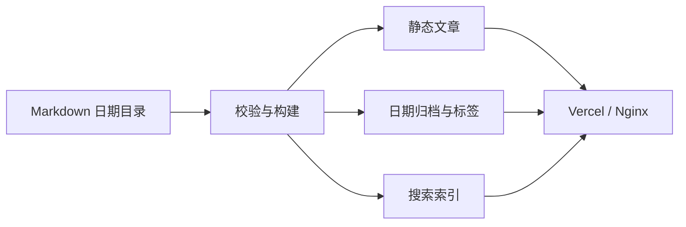
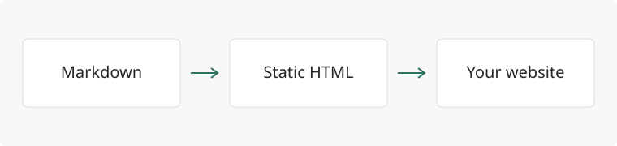

这份指南演示正文排版、代码和图表的写法，可以直接参考本文的 Markdown 源文件。首次写文章时，先阅读[博客编写与发布指南](../17/blog-writing-guide)，了解目录、标签和发布步骤。

## 文字与链接

支持 **粗体**、*斜体*、~~删除线~~、==高亮==、行内代码 `const message = 'hello'`，以及 H~2~O 和 x^2^。

文章之间可以使用相对链接，例如[博客编写与发布指南](../17/blog-writing-guide)。完整语法参考 [VitePress 文档](https://vitepress.dev/guide/markdown)。

```markdown
[博客编写与发布指南](../17/blog-writing-guide)
```

> 记录一次清晰的思考，比堆积许多零散的片段更有价值。

### Emoji

可以直接输入 Unicode Emoji，例如 🚀、📝、✅；也支持简码 :rocket:、:memo:、:white_check_mark:。

```markdown
🚀 开始写作
:memo: 记录想法
:white_check_mark: 完成发布
```

Emoji 的外观由读者设备决定。通用图标库需要自行安装并作为 Vue 组件引入，不属于 Emoji 简码功能。

## 代码高亮与行号

代码在构建时高亮，读者不需要额外下载语法解析器。语言标记支持 `csharp`、`typescript`、`vue`、`sql`、`bash`、`json` 等。右上角可复制代码。

```csharp {3-4}
var builder = WebApplication.CreateBuilder(args);

builder.Services.AddScoped<IGreetingService, GreetingService>();
var app = builder.Build();

app.MapGet("/hello", (IGreetingService service) => service.Hello());
app.Run();
```

### 代码差异与聚焦

```typescript
const timeout = 1000 // [!code --]
const timeout = 3000 // [!code ++]
const controller = new AbortController() // [!code focus]
```

### 多文件代码分组

::: code-group

```typescript [client.ts]
export async function getPosts() {
  const response = await fetch('/posts.json')
  if (!response.ok) throw new Error('无法加载文章')
  return response.json()
}
```

```json [example.json]
{
  "title": "一篇新的记录",
  "tags": ["Vue", "TypeScript"]
}
```

:::

::: tip 写作建议
用 `{3-4}` 标记代码行，用 `[!code ++]` 与 `[!code --]` 展示差异。代码示例只展示文本，不在访问者浏览器中执行。
:::

## 表格与任务列表

| 能力 | 写法 | 处理方式 |
| :--- | :--- | :--- |
| 文章 | `.md` | 构建时生成 HTML |
| 日期 | `YYYY/MM/DD` | 由目录提取 |
| 多标签 | `tags: [Vue, TypeScript]` | 自动生成标签页 |
| 图片 | 相对路径 | 构建时收集静态资源 |

- [x] 为文章写清晰的标题和摘要
- [x] 添加多个相关标签
- [ ] 完成下一篇技术记录

## 数学公式

行内公式 $O(n \log n)$ 可以直接穿插在段落中。独立公式如下：

$$
\sum_{i=1}^{n} i = \frac{n(n+1)}{2}
$$

## Mermaid 图表

使用围栏语言 `mermaid` 可以绘制流程图、时序图等。下面展示这个博客的内容处理过程。



图表随明暗主题切换。无法渲染时仍能展开阅读图表源码。

## 注释、定义与折叠内容

脚注能让补充信息保持在正文之外。[^note]

SSG
: 在构建阶段生成各个路由的 HTML，部署时只需要静态文件服务器。

HTML 的语义结构有助于浏览器理解内容。

*[HTML]: HyperText Markup Language

::: details 查看目录约定
例如 `content/posts/2026/09/16/markdown-guide.md`，发布日期为 `2026-09-16`。目录是日期的唯一来源；无需重复填写 `date`。
:::

::: warning 内容约定
移动文章的日期目录会改变文章地址。文章发布后需要调整目录时，也应配置旧地址到新地址的重定向。
:::

[^note]: 脚注、定义列表、任务列表和高亮标记由 Markdown 插件处理。

## 本地图片

支持同目录或相邻目录中的图片。下面是一张随文章一起存放的 SVG 示例图：


